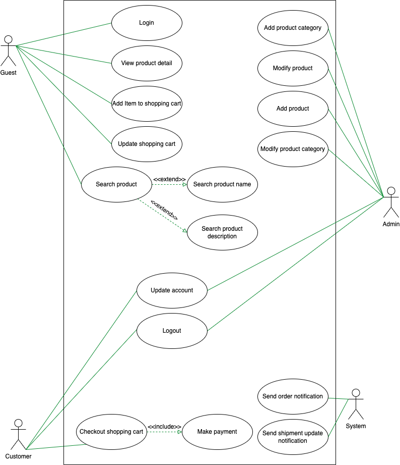

# Design Ecommmerce Web

## Use case Diagram

### We have four main **Actors** in our system:

- Admin: Responsible for adding/modifying products, and categories.
- Guest: All guests can search products, add/remove item to the shopping cart, and view product's detail, as well as become member.
- Member: Members can perform all the activities that guests can, in addition to which, they can checkout the shopping cart.
- System: responsible for sending notifications for orders and shipping updates.

### Use case diagram

# Class diagram
